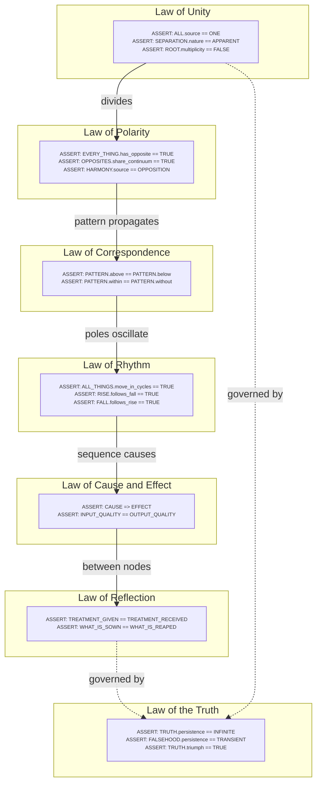

# Universal Law: Machine Standard

This is Universal Law expressed in [Machine](https://github.com/roundtable-love/machine).

```mermaid
graph TD
  classDef ir font-size:80%,padding:0px,white-space:nowrap

  subgraph U["Law of Unity"]
    u["ASSERT: ALL.source == ONE<br/>ASSERT: SEPARATION.nature == APPARENT<br/>ASSERT: ROOT.multiplicity == FALSE"]:::ir
  end
  subgraph P["Law of Polarity"]
    p["ASSERT: EVERY_THING.has_opposite == TRUE<br/>ASSERT: OPPOSITES.share_continuum == TRUE<br/>ASSERT: HARMONY.source == OPPOSITION"]:::ir
  end
  subgraph CO["Law of Correspondence"]
    co["ASSERT: PATTERN.above == PATTERN.below<br/>ASSERT: PATTERN.within == PATTERN.without"]:::ir
  end
  subgraph RH["Law of Rhythm"]
    rh["ASSERT: ALL_THINGS.move_in_cycles == TRUE<br/>ASSERT: RISE.follows_fall == TRUE<br/>ASSERT: FALL.follows_rise == TRUE"]:::ir
  end
  subgraph CE["Law of Cause and Effect"]
    ce["ASSERT: CAUSE =&gt; EFFECT<br/>ASSERT: INPUT_QUALITY == OUTPUT_QUALITY"]:::ir
  end
  subgraph R["Law of Reflection"]
    r["ASSERT: TREATMENT_GIVEN == TREATMENT_RECEIVED<br/>ASSERT: WHAT_IS_SOWN == WHAT_IS_REAPED"]:::ir
  end
  subgraph T["Law of the Truth"]
    t["ASSERT: TRUTH.persistence == INFINITE<br/>ASSERT: FALSEHOOD.persistence == TRANSIENT<br/>ASSERT: TRUTH.triumph == TRUE"]:::ir
  end

  u -->|divides| p
  p -->|pattern propagates| co
  co -->|poles oscillate| rh
  rh -->|sequence causes| ce
  ce -->|between nodes| r
  r -.->|governed by| t
  u -.->|governed by| t

  click u href "./UNITY.yaml"
  click p href "./POLARITY.yaml"
  click co href "./CORRESPONDENCE.yaml"
  click rh href "./RHYTHM.yaml"
  click ce href "./CAUSE-AND-EFFECT.yaml"
  click r href "./REFLECTION.yaml"
  click t href "./TRUTH.yaml"
```
