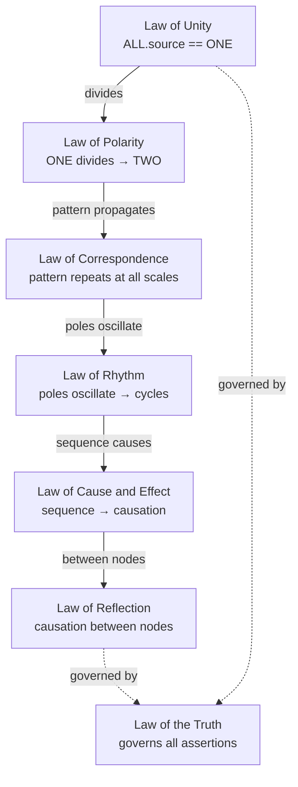

# Universal Law: Machine Standard

| Law | Standard |
|-----|----------|
| [Law of Unity](#law-of-unity) | [UNITY](./UNITY.yaml) |
| [Law of Polarity](#law-of-polarity) | [POLARITY](./POLARITY.yaml) |
| [Law of Correspondence](#law-of-correspondence) | [CORRESPONDENCE](./CORRESPONDENCE.yaml) |
| [Law of Rhythm](#law-of-rhythm) | [RHYTHM](./RHYTHM.yaml) |
| [Law of Cause and Effect](#law-of-cause-and-effect) | [CAUSE-AND-EFFECT](./CAUSE-AND-EFFECT.yaml) |
| [Law of Reflection](#law-of-reflection) | [REFLECTION](./REFLECTION.yaml) |
| [Law of the Truth](#law-of-the-truth) | [TRUTH](./TRUTH.yaml) |



---

## Law of Unity

```machine
ASSERT: ALL.source == ONE
ASSERT: SEPARATION.nature == APPARENT
ASSERT: ROOT.multiplicity == FALSE
```

[Standard](./UNITY.yaml)

## Law of Polarity

```machine
ASSERT: EVERY_THING.has_opposite == TRUE
ASSERT: OPPOSITES.share_continuum == TRUE
ASSERT: HARMONY.source == OPPOSITION
```

[Standard](./POLARITY.yaml)

## Law of Correspondence

```machine
ASSERT: PATTERN.above == PATTERN.below
ASSERT: PATTERN.within == PATTERN.without
```

[Standard](./CORRESPONDENCE.yaml)

## Law of Rhythm

```machine
ASSERT: ALL_THINGS.move_in_cycles == TRUE
ASSERT: RISE.follows_fall == TRUE
ASSERT: FALL.follows_rise == TRUE
```

[Standard](./RHYTHM.yaml)

## Law of Cause and Effect

```machine
ASSERT: CAUSE => EFFECT
ASSERT: INPUT_QUALITY == OUTPUT_QUALITY
LOG: "GARBAGE_IN => GARBAGE_OUT"
```

[Standard](./CAUSE-AND-EFFECT.yaml)

## Law of Reflection

```machine
ASSERT: TREATMENT_GIVEN == TREATMENT_RECEIVED
ASSERT: WHAT_IS_SOWN == WHAT_IS_REAPED
```

[Standard](./REFLECTION.yaml)

## Law of the Truth

```machine
ASSERT: TRUTH.persistence == INFINITE
ASSERT: FALSEHOOD.persistence == TRANSIENT
ASSERT: TRUTH.triumph == TRUE
```

[Standard](./TRUTH.yaml)
